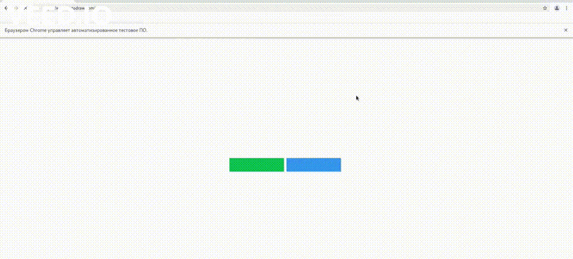

Human-like mouse moving framework.

# Features

- Get web elements positions by xpath.
- Randomized movement speed and direction, click duration, sleep time between actions.
- The most of randomly generated variables provided by the Strategy class. Modify it or create new one.